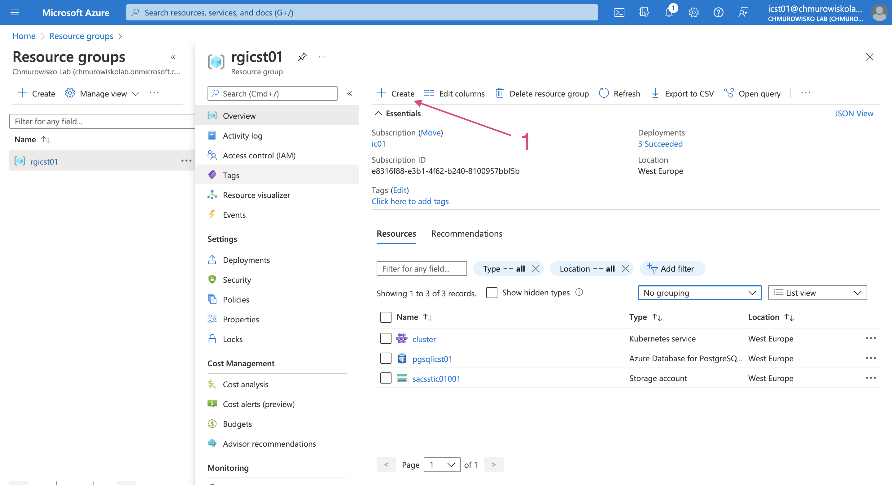
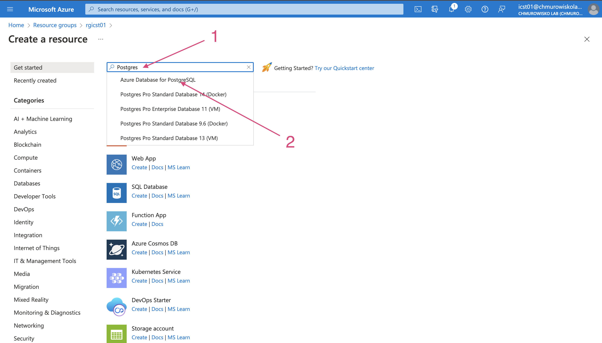
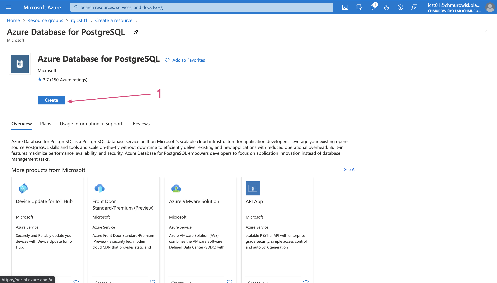
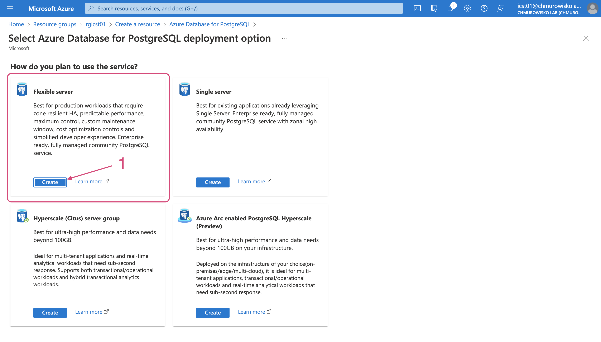
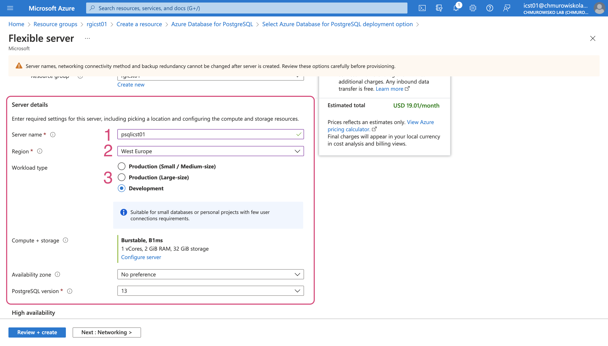
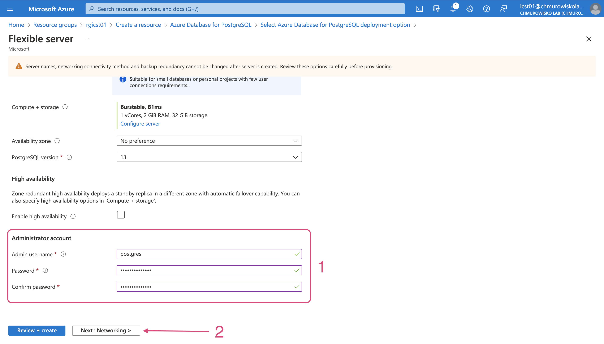
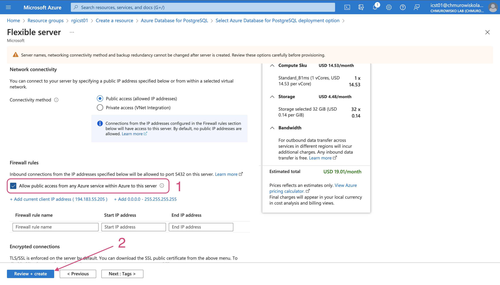
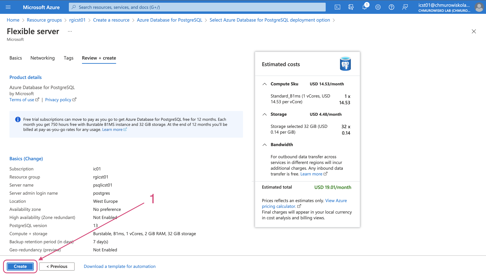
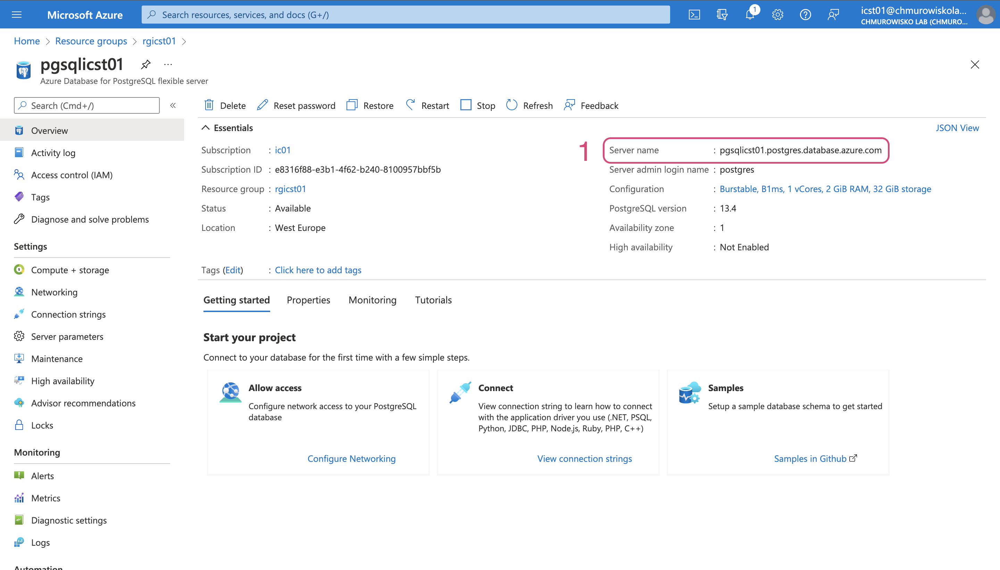

<br><br>
<br><br>
<br><br>

# Connection beetwen database using Azure Database

---

## Task 1: Create Postgres server in Azure Database

**Note**: The configuration of access to the Postgres server shown below is recommended only for training purposes (or when appropriate). In other cases, we recommend configuring the server to connect to it only from services located in the same virtual network. To configure your Azure infrastructure in this way use the attached [Terraform files](./terraform).


Do this steps:






In a section _Server details_ provide the following values:

  - Server name: `psql<STUDENT_LOGIN>`
  - Region: `West Europe`
  - Workload type: `Development`



In a section _Administrator account_ provide the following values:

  - Admin username: `postgres`
  - Password: `Chmurowisko123`



**Note**: In this step you will specify how to access the Postgres server. The configuration shown in the figure allows you to connect to the server from all services in Azure. This is the simplest configuration option, but not the most secure.




## Task 2: Verify connection beetwen AKS and Azure Database

1. View the Postgres server details page and copy _Server name_:

    

2. Create a test Pod to verify connection to Postgres server:

    ```bash
    kubectl run debug --image=postgres -it --rm --restart=Never -- sh
    ```

3. Try to connect with Postgres server:

    ```bash
    psql 'host=<DB_SERVER_NAME> port=5432 dbname=postgres user=postgres sslmode=require password=Chmurowisko123'
    ```

## Task 3: Create database and table with data

1. Being connected to the Postgres server from the test Pod, run the following commands:

    - Create database named: `test`

        ```bash
        CREATE DATABASE test;
        ```

    - Connect to database:

        ```
        \c test
        ```

    - Create a new table `people`

        ```
        CREATE TABLE people (
          pid SERIAL PRIMARY KEY,
          firstName varchar(255),
          lastName varchar(255)
        );
        ```

    - Add data to the table `people`:

        ```
        INSERT INTO people (firstName, lastName) VALUES ('Joe', 'Doe'), ('Jane', 'Dee');
        ```

    - Create testing query to get data from table `people`:

        ```
        SELECT * FROM people;
        ```

## Task 4: Implement an application that reads data from the database

**Note**: The code of the application implemented in this step is located in the folder [/app](./app). Container image is public in [Docker Hub](https://hub.docker.com/repository/docker/macborowy/azure-database-psql).

1. View the content of the file [/files/deployment.yaml](./files/deployment.yaml)
2. In the ConfigMap `cm-azure-database-connection-details` change value of the key `PGHOST`. Make sure that the other values match those specified during Postgres server configuration.
3. Deploy the application:

    ```bash
    kubectl apply -f deployment.yaml
    ```

4. Find an external IP of your Service `api`:

    ```bash
    kubectl get svc
    ```

5. Make a request to the endpoint `/people` check that you are getting a list of users that matches the data in the database:

    ```bash
    curl http://<API-PUBLIC-IP>/people
    ```

## END LAB

<br><br>

<center><p>&copy; 2023 Cloud Value Professional<p></center>
